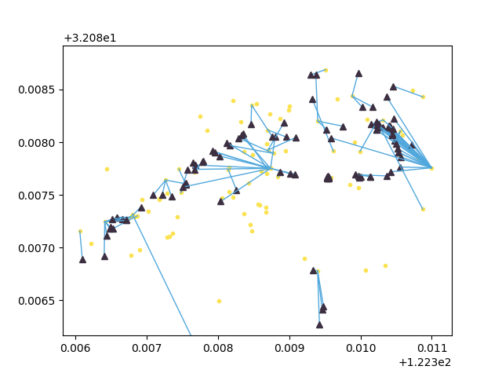

# 2017 CCF 大数据竞赛思路及源码分享
 **比赛：蚂蚁金服：精准室内定位**，线下赛最终经过作弊筛选后是前100，共有2845支队伍，因为当时和小伙伴都不太会MapReduce，加上还有两个周期末考试了然而我为了比赛完全没有复习，所以复赛就弃了。
## 1.题目
给出用户在商场使用手机支付时所采集到的信息，包括用户信息，店铺信息，商场信息等，要求预测给出上述信息后精准预测用户所在店铺。具体给出的数据表可以点击[这里](https://tianchi.aliyun.com/competition/information.htm?spm=5176.100067.5678.2.647adc0v8Xce5&raceId=231620)来看。
## 2.大致分析与思路
虽然给出了比较多的信息，包括很多的用户信息和商店类别之类的看似有用的信息，但是做过这个比赛的都知道，其实是一个Wifi定位的问题，当然其他的信息经过正确的特征提取也会给模型带来增益，但是绝大程度上的精确度都是由wifi信息来提供的。所以，如何有效的提取wifi信息，去除其中的噪音，构造与wifi信息相关的特征，就是比赛的关键。
## 3.具体做法
### 1.数据预处理
+ 删除公共wifi，因为本题中给出了mall信息，当两个mall距离较远的情况下，同一个wifiId在这两个mall或多个mall都出现过的话，那么就可以判定这个wifiId是公共wifi或者是个人热点。
+ 训练集和测试集wifi取交集，因为对于wifi指纹或我们后来构造的wifi特征来说，只在train中出现过或只在test中出现过的wifi都是无用的，甚至可能是噪音。
+ 离群值的去除，没发现有什么离群点，部分wifi强度值有缺失，这里没有进行处理，因为模型对缺失值自动处理的效果比较好
### 2.经纬度信息
给了两种经纬度信息，一种是店铺经纬度（固定值），一种是买家付款时的经纬度，两种经纬度理论上差距应该很小，实际部分差距很大

+ 通过对精度的调整做了一个小的离散化处理
+ 欧氏距离特征
+ 曼哈顿距离特征
+ 经纬度聚类（效果一般）
### 3.时间特征的处理
+ 提取饭点特征
+ 提取早晨和深夜指示特征，因为这两种店可能比较固定
### 4.用户特征
+ 用户购买力
+ 用户常去商店
这里的用户特征是个坑，奥斯卡之夜也有人演过这一出，用户特征的提取会使得本地验证的分数提高不少，但是实际上可能是个噪音，因为测试集里的用户更换了绝大多数，记得好像只有不到1/5之一的旧用户吧，但是在训练集里用户特征会占很高的重要性，所以在将来会出现一些预测上的偏差，它们是要负责任的。
### 5.Wifi特征
wifi特征是最主要的部分，这里我们主要构建了如下的wifi特征
**(1)当前用户连接到的最强wifi**
转换成规则的话其实是一个极大似然估计，举个例子来说，当我能搜索到的最强wifi是wifi0的时候，在历史上最强wifi是wifi0的时候有80个人在A店铺，5个人在B店铺，10个人在C店铺，那么我最大可能当前在A店铺。这个特征算是一个比较强的特征了。
**(2)wifi出现的次数**
搜索到的wifi数，wifi历史计数
**(3)店铺wifi指纹**
根据每个店铺历史上出现过的wifi和强度建立wifi强度指纹库，取每个wifi出现过的所有值得中位数作为最终指纹值，比对当前强度wifi和指纹库
**(4)商场wifi原点**
根据整个商场历史上出现过的wifi和强度（统计频率，只取出现频率前50的wiif）建立一个原点wiif，计算每条数据wiif的wifi序列到wifi原点的欧氏距离
**(5)高频wifi强度特征**
也是先统计所有wifi出现过的次数，选其中出现频率高的wifi，每一个wifi及其强度作为一个特征，效果较好。
**后处理**除了特征以外，还用了一些简单的规则来对预测数据进行后处理，相对于模型预测来说，后处理可处理的数据很少，但是相对于模型来说更加准确。
+ wiif强度序列完全相同
+ 当前连接的wifi在历史上所在店铺的极大似然
其实在作比赛的时候远远试了比这些更多的特征，但是因为效果不好都去掉了，最后提交模型一共使用了以上特征。
## 4.数据集划分
因为这是个时间相关的预测问题，所以应该和大多数人一样，最终我选取了最后一个周进行训练，特征提取是在整个训练集上进行的
## 5.模型
最开始我们使用了xgb的多分类模型，分mall进行预测，效果一般，然后转而使用二分类实现多分类，依然分mall进行预测，提升显著。
具体做法是使用N个二分类器，分别对每个mall的每个店铺进行二分类得到一个二分类器，然后对数据进行预测，这样对于每一个二分类器都可以得到一个预测概率值，选取其中预测最大的概率值对应的店铺作为最终分类结果。

| 样本      | 分类器1    |  分类器2  |
| ---- | ----:   | :---: |
| 1        | 0.12      |   0.131    |
| 2        | 0.13      |   0.03    |
| 3        | 0.94      |   0.001    |

大概就是表格里这种（值是我瞎写的）
这样做的好处还有一个是模型融合的时候会很快捷和高效，直接将模型概率加权相加即可
## 6.模型融合
最后我们取了 0.65*xgb + 0.35*lgb 概率加权融合

就写这么多，比赛过去两个月了好多东西都忘了，以后想到再补充。
